*How I built a comprehensive template that combines Next.js, Supabase, Terraform, and modern DevOps to eliminate the "setup tax" on personal projects.*

---

## The Setup Tax Problem

You have a brilliant idea for a personal project. But before you can start building, you need to:

- Set up Next.js with TypeScript
- Configure authentication (Supabase + Google OAuth)
- Set up a PostgreSQL database with migrations
- Deploy to Vercel with custom domains
- Configure DNS through Cloudflare
- Set up email routing
- Add pre-commit hooks and code quality tools
- Write documentation

By the time you're done, you've spent **days** on boilerplate instead of building features. This is what I call the "setup tax" - the hidden cost of starting new projects.

## The Solution: A Production-Ready Template

I created a **personal project template** that eliminates the setup tax. 

Here's what you get:

### 🚀 **Modern Stack, Zero Configuration**

```bash
# Create from template
gh repo create my-project --template your-username/personal-project-template

# Setup and deploy
cd my-project
./scripts/setup.sh
terraform apply
npm run dev
```

**That's it.** You now have:
- ✅ Next.js 14 with TypeScript and Tailwind CSS
- ✅ Supabase database with authentication
- ✅ Google OAuth integration
- ✅ Vercel deployment with custom domain
- ✅ Cloudflare DNS and CDN
- ✅ Email routing for your domain
- ✅ Pre-commit hooks and code quality tools
- ✅ Comprehensive documentation

### 🏗️ **Infrastructure as Code**

Everything is managed through Terraform modules:

```hcl
module "dns" {
  source = "./modules/dns"
  domain_name = var.domain_name
}

module "vercel" {
  source = "./modules/vercel"
  project_name = var.project_name
}

module "supabase" {
  source = "./modules/supabase"
  # ... configuration
}
```

One `terraform apply` command provisions your entire infrastructure.

### 🔐 **Security Built-In**

- HTTPS everywhere with Cloudflare
- DDoS protection and rate limiting
- JWT-based authentication
- Row-level database security
- Automated security scanning
- Secret detection in pre-commit hooks

### 🛠️ **Developer Experience**

The template includes a working demo (todo list with auth) that shows:
- User registration and login
- Real-time database updates
- Responsive design
- Server-side rendering

### 💰 **Cost-Effective with Generous Free Tiers**

One of the best parts? This entire stack runs on **generous free tiers**:

- **Vercel**: Unlimited personal projects, 100GB bandwidth/month
- **Supabase**: 500MB database, 50,000 monthly active users, 2GB bandwidth
- **Cloudflare**: Free DNS, CDN, and basic security features
- **Google Auth**: Free OAuth integration
- **GitHub**: Free hosting for your template and documentation

**Total cost for personal projects: $0/month** 🎉

This means you can build, test, and deploy multiple projects without worrying about infrastructure costs. Perfect for learning, side projects, and early-stage startups.

## The Architecture

Here's how everything flows together:

```mermaid
graph LR
    A[👤 User] --> B[☁️ Cloudflare]
    B --> C[▲ Vercel]
    C --> D[🗄️ Supabase]
    D --> E[🔐 Google Auth]
    
    B --> F[DNS & CDN]
    C --> G[Next.js App]
    D --> H[Database & Auth]
    E --> I[Social Login]
```



**Cloudflare** handles DNS, CDN, and security. **Vercel** hosts your Next.js app. **Supabase** provides the database and auth. **Google Auth** enables social login.

## Real Impact

Since using this template, I've been able to:

- **Start new projects in 30 minutes** instead of multiple hours
- **Focus on features** instead of infrastructure
- **Maintain consistent quality** across all projects
- **Reduce cognitive load** when starting new projects
- **Build without budget constraints** - everything runs on free tiers
- **Experiment freely** without worrying about hosting costs

## The Technical Details

The template includes:

- **Interactive setup scripts** for easy configuration
- **Pre-commit hooks** for code quality
- **Infrastructure modules** for reusability
- **Security scanning** integrated into development workflow
- **Detailed documentation** for every component

## Try It Yourself

Ready to eliminate the setup tax? The template is available on GitHub:

**🔗 [Explore the Template →](https://github.com/agrana/free_personal_stack)**

## Key Takeaways

1. **Automation eliminates the setup tax** - The more you can automate, the more time you have for actual development.

2. **Security should be built-in** - Not something you add later, but part of the foundation.

3. **Developer experience matters** - If the tooling is hard to use, developers won't use it.

4. **Documentation is essential** - Good docs aren't just nice to have; they're critical for adoption.

5. **Free tiers enable experimentation** - Generous free tiers from modern providers make it possible to build production-ready apps without upfront costs.

## What's Next?

The template is continuously evolving. Current focus areas:
- Additional authentication providers
- More database options
- Enhanced monitoring
- Mobile app integration

## Conclusion

Building this template has transformed how I approach personal projects. Instead of spending days on infrastructure setup, I can now focus on what matters most: building features that solve real problems.

**What would you build if you could start from a production-ready foundation in minutes instead of days?**

---

*Have questions about the template? Check out the [GitHub repository](https://github.com/your-username/personal-project-template) or reach out on [Twitter](https://twitter.com/your-username).*

---

**Tags:** #NextJS #Supabase #Terraform #DevOps #WebDevelopment #Productivity #Infrastructure #TypeScript
