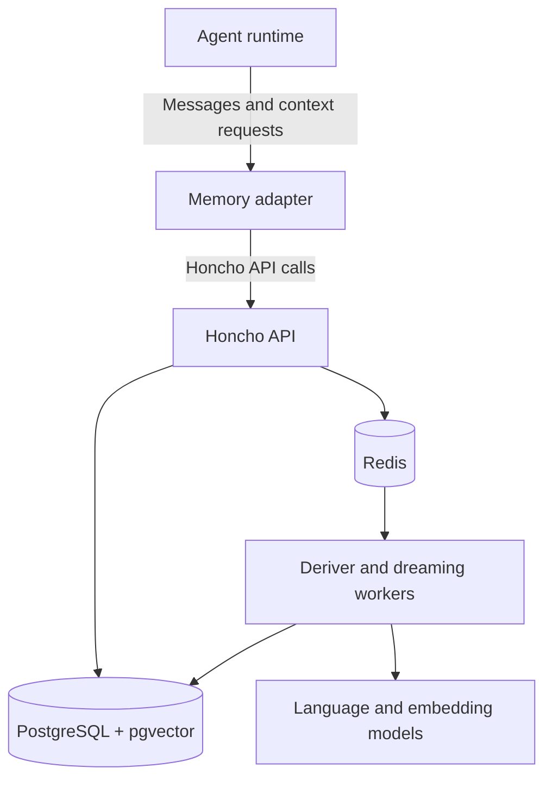
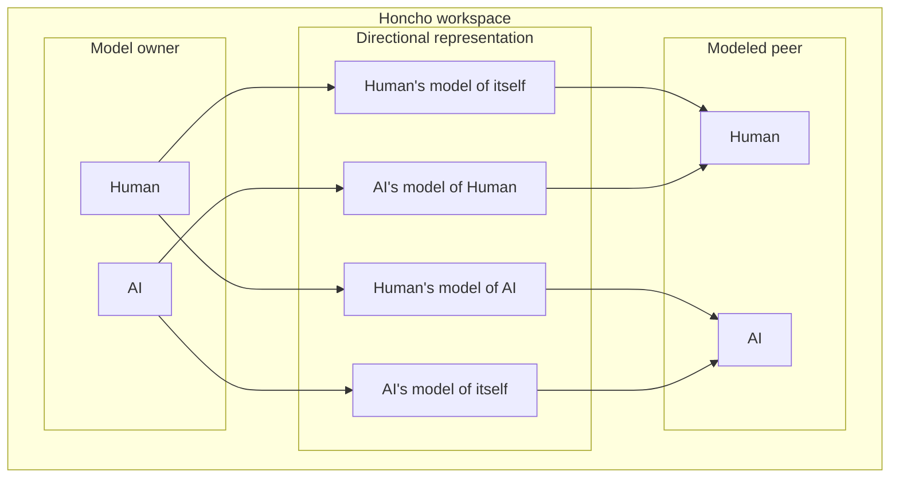
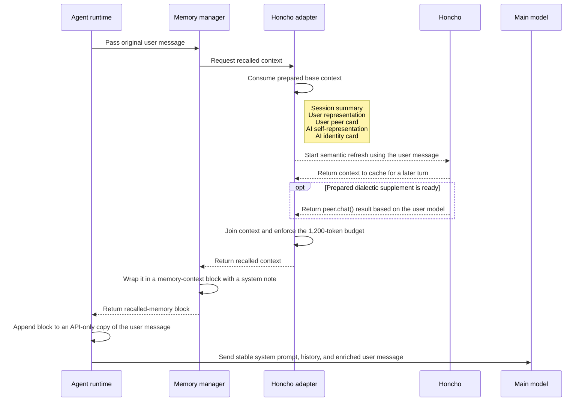

# How I Run Honcho for Long-Term Agent Memory

 I self-host [Honcho](https://honcho.dev/) as the shared memory backend for my agents. Honcho stores what happened, derives useful conclusions, models the participants, and returns relevant context.

This article follows the process from message ingestion to memory recall, including conclusions, directional representation of peers and dreaming.

## Honcho storage

Agents write messages to Honcho inside a workspace. Honcho turns those messages into several forms of memory:

- Messages (conversation history).
- Embeddings support semantic retrieval.
- Conclusions capture facts and patterns derived from conversations.
- Session summaries
- Peer representations model what one participant knows or believes about another.
- Dialectic recall builds context for the current conversation from stored memory.

## Architecture




- The agent runtime delegates memory operations to an adapter.
- The Honcho API receives messages, persists records, queues derivation work, and serves recall requests.
- PostgreSQL with pgvector stores records and their embeddings.
- Redis coordinates caching and queued derivation work.
- The deriver turns new messages into conclusions and representations.
- Dreaming workers revisit accumulated conclusions and consolidate them.

## Peers and directional representations

Honcho organizes memory in workspaces that isolate their records. Peers are created independently inside a workspace, so a workspace can contain zero, one, or many peers. For a human-agent memory system, a sensible default is to have two peers:

- `Human` represents the user.
- `AI` represents the agent.

In my current deployment, the `AI` peer represents Hermes.

Each observer-observed pairing maintains a directional representation, or mental model:



Each relationship can have a peer card and a larger body of conclusions. A peer card contains a small set of stable identity facts. Conclusions contain observations and deductions that can evolve.

## Connecting an agent to Honcho

An agent integration connects its runtime to Honcho through a memory adapter. The adapter writes completed exchanges, requests relevant context, and converts Honcho's response into the runtime's model-input format.

My Hermes implementation provides two context paths: automatic recalled memory and explicit memory tools. At startup, Hermes reads `memory.provider: honcho`, loads the Honcho adapter, resolves the session, and registers five Honcho tools. It adds a short capability notice to the cached system prompt.

The adapter then starts a background prewarm for the selected Honcho session. The prewarm requests base context and a dialectic synthesis so the first useful turn can begin with memory available.

For each non-trivial user turn, the following sequence runs:



This sequence shows the prewarmed recall path in my current adapter. Other agent runtimes can implement the same write-and-recall contract with their own timing, token budget, and session strategy.

The shape of the API-only user message is approximately:

```text
<the user's current message>

<memory-context>
[System note identifying this as recalled reference data]

## Session Summary
...

## User Representation
...

## User Peer Card
...

## AI Self-Representation
...

## AI Identity Card
...

<dialectic supplement>
</memory-context>
```

The injected block exists only in the model request. The recalled context remains available for each model call in the tool loop.

My adapter skips automatic injection for acknowledgements and slash commands. 
An unavailable Honcho service produces an empty recall result while the agent continues the conversation.

The Hermes adapter's hybrid mode also exposes `honcho_profile`, `honcho_search`, `honcho_context`, `honcho_reasoning`, and `honcho_conclude`. Their results enter the conversation as normal tool responses and complement the automatic context block.

## How memory is stored

After an agent completes a response, its memory adapter sends the original user message and final assistant response to Honcho on a background worker. My adapter keeps interrupted turns out of the durable memory stream because their tool chain or response may be incomplete.

The same worker starts recall for the next turn. Base context refreshes every turn in my configuration. Dialectic synthesis starts at session initialization and then becomes eligible every two turns. The next non-trivial turn consumes the prepared result. A single dialectic pass starts at low reasoning effort, and the query-length heuristic can raise it as far as high.

The deriver processes saved messages into conclusions and representations. It groups representation work around a 512-token target, so a small pending batch is a normal waiting state.

Dreaming handles slower consolidation. A cycle becomes eligible after 50 new explicit conclusions, with an eight-hour cooldown and a 60-minute idle period. It can reconcile existing conclusions, derive new ones, and update stable representations. I verified that these cycles run on my installation.

## Session boundaries

Honcho sessions group messages and derived context around a conversation or workstream. I configured my current adapter to use a per-repository session strategy. I also mapped `/home/<username>` to a `personal` session.

When I start an agent inside a repository, that repository normally determines the Honcho session. Starting Hermes in the Honcho repository resolves to the `honcho` session. The session key is selected at startup.

This makes the workstream the task boundary and the repository the default starting point.

## Reusable pattern

Honcho makes long-term memory a service shared by agent runtimes. An agent writes completed exchanges through its memory adapter, the Honcho API persists them and queues derivation work, background workers build conclusions and representations, and the adapter retrieves relevant context for a later model request.

Workspaces provide isolation, peers define the participants, directional representations preserve perspective, and sessions establish retrieval boundaries. Hermes is one client of this memory service. The same integration boundary lets additional agents use Honcho without duplicating the storage, derivation, and recall system.
