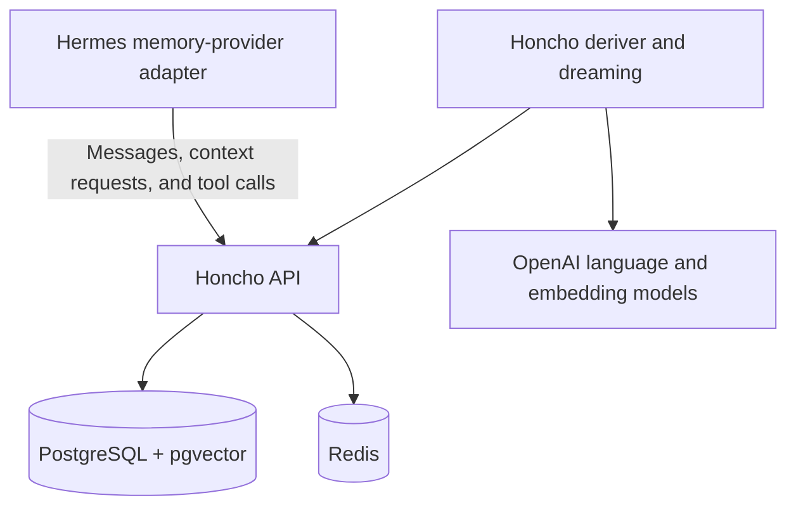
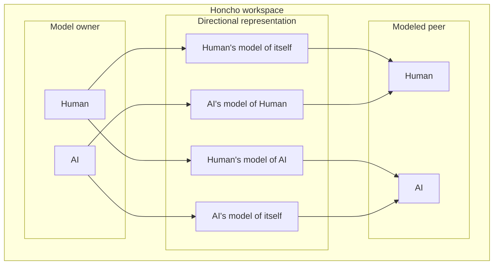
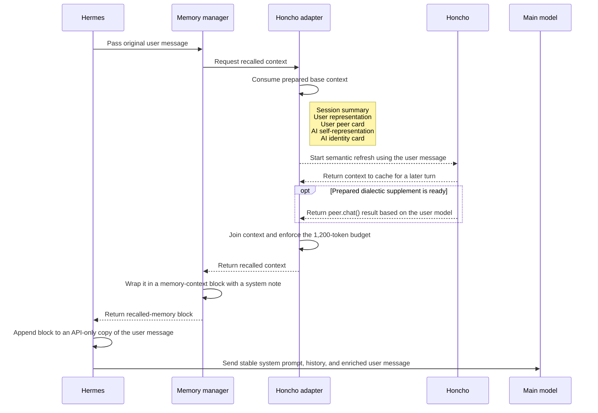

# How I Run Honcho for Hermes: Long-Term Memory and Personalities

In [my Hermes setup]({{ '/my-hermes-agent-setup/' | relative_url }}), I described Honcho as the system that gives Hermes long term memory.
I have since worked through the system from message ingestion to recall, including dreaming, session boundaries and more.

[Honcho](https://honcho.dev/) stores what happened, derives useful conclusions, models the participants, and returns relevant context later.

## Honcho storage

Honcho receives messages from Hermes inside a workspace. It turns those messages into several forms of memory:

- Messages (conversation history).
- Embeddings support semantic retrieval.
- Conclusions capture facts and patterns derived from conversations.
- Session summaries preserve the shape of longer work.
- Peer representations model what one participant knows or believes about another.
- Dialectic recall builds context for the current conversation from stored memory.

## Architecture




- The Honcho API receives messages and serves recall requests.
- PostgreSQL with pgvector extension stores embeddings.
- Redis provides a shared cache for the API and deriver.
- The deriver turns new sessions into conclusions and representations.
- Dreaming revisits accumulated conclusions and consolidates them.

## Directional peers

Honcho organizes memory in workspaces that isolate their records. This workspace
has at least two peers:

- `Human` represents me.
- `AI` represents Hermes.

Each model owner observes a peer and maintains a mental model:



Each relationship can have a peer card and a larger body of conclusions. A peer card contains a small set of stable identity facts. Conclusions contain observations and deductions that can evolve.

## Honcho context 

The installed Hermes integration has two context paths: a static provider notice and live recalled memory.

At startup, Hermes reads `memory.provider: honcho`, loads the Honcho adapter, resolves the session and registers five Honcho tools. It adds a short notice to the cached system prompt stating that Honcho runs in hybrid mode, automatic recall is active, and memory tools are available. This notice describes the capability. It contains no recalled facts.

Hermes then starts a background prewarm for the selected Honcho session. The prewarm requests base context and a dialectic synthesis so the first useful turn can begin with memory available.

For each non-trivial user turn, the following sequence runs:



The shape of the API-only user message is approximately:

```text
<the user's current message>

<memory-context>
[System note identifying this as recalled reference data]

## Session Summary
...

## User Representation
...

## User Peer Card
...

## AI Self-Representation
...

## AI Identity Card
...

<dialectic supplement>
</memory-context>
```

The injected block exists only in the model request. for each model call in the tool loop, The recalled context remains available while it uses tools.

Trivial prompts such as acknowledgements and slash commands skip automatic injection. An unavailable Honcho service produces an empty recall result while Hermes continues the conversation.

Hybrid mode also exposes `honcho_profile`, `honcho_search`, `honcho_context`, `honcho_reasoning`, and `honcho_conclude`. When Hermes calls one of these tools, its result enters the conversation as a normal tool response. This explicit tool path complements the automatic context block.

## How memory is stored 

After the agent completes a response, the memory manager sends the original user message and final assistant response to Honcho on a background worker. Interrupted turns stay out of the durable memory stream because their tool chain or response may be incomplete.

The same worker starts recall for the next turn. Base context refreshes every turn in my configuration. Dialectic synthesis starts at session initialization and then becomes eligible every two turns. The next non-trivial turn consumes the prepared result. A single dialectic pass starts at low reasoning effort, and the query-length heuristic can raise it as far as high.

The deriver processes saved messages into conclusions and representations. It groups representation work around a 512-token target, so a small pending batch is a normal waiting state.

Dreaming handles slower consolidation. A cycle becomes eligible after 50 new explicit conclusions, with an eight-hour cooldown and a 60-minute idle period. It can reconcile existing conclusions, derive new ones, and update stable representations. I verified that these cycles run on my installation.

## Sessions

I configured Hermes to use a per-repository session strategy. I also mapped `/home/<username>` to a `personal` session.

When I start Hermes inside a repository, that repository normally determines the Honcho session. Starting it in the Honcho repository resolves to the `honcho` session. The session key is selected at startup.

This makes the workstream the task boundary and the repository the default starting point.
