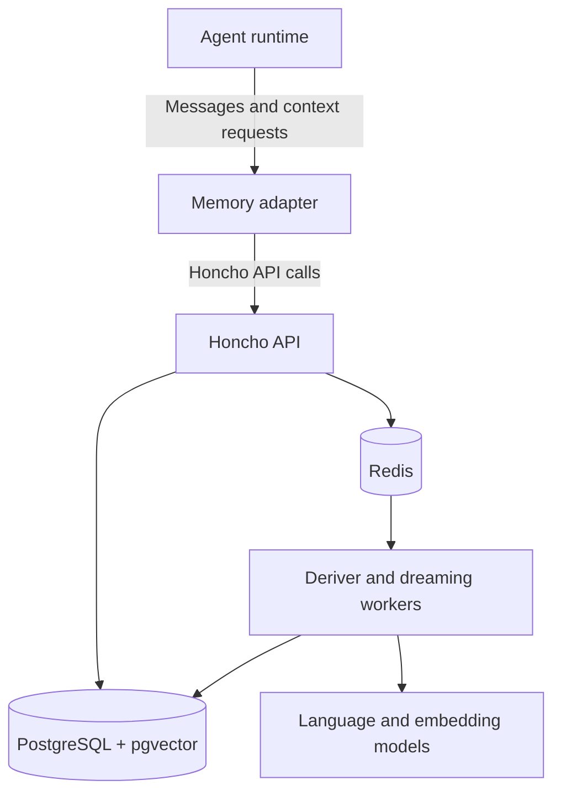
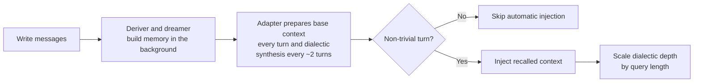
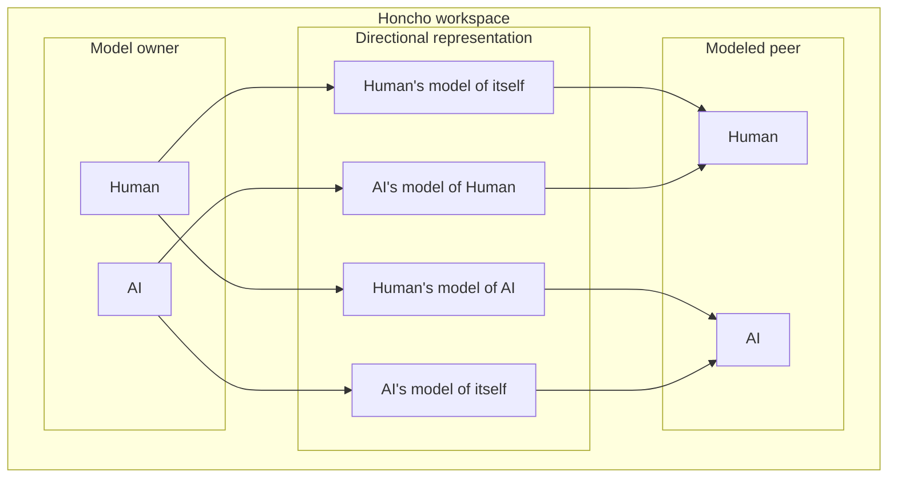
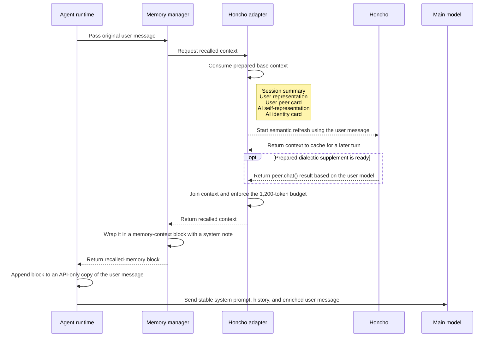

# How I Run Honcho for Long-Term Agent Memory

<figure class="post-hero">
  
</figure>


 I self-host [Honcho](https://honcho.dev/) as the shared memory backend for my agents. Honcho stores what happened, derives useful conclusions, models the participants, and returns relevant context.

This article follows the process from message ingestion to memory recall, including conclusions, directional representation of peers and dreaming.

## Honcho storage

Agents write messages to Honcho inside a workspace. Honcho turns those messages into several forms of memory:

- Messages (conversation history).
- Embeddings support semantic retrieval.
- Conclusions capture facts and patterns derived from conversations.
- Session summaries
- Peer representations model what one participant knows or believes about another.
- Dialectic recall builds context for the current conversation from stored memory.

## Architecture




## Components

- The agent runtime delegates memory operations to an adapter.
- The Honcho API receives messages, persists records, queues derivation work, and serves recall requests.
- PostgreSQL with pgvector stores records and their embeddings.
- Redis coordinates caching and queued derivation work.
- The deriver turns new messages into conclusions and representations.
- Dreaming workers revisit accumulated conclusions and consolidate them.

## How memory is stored

The flow is:



After an agent completes a response, it's memory adapter sends the original user prompt and final response to Honcho on a background worker. 

Those saved interactions enter Honcho's background pipeline. The deriver processes them into conclusions and representations. It groups representations in batches of around a 512-tokens, so short messages can sit in a small pending batch until enough content accumulates. Dreaming handles slower consolidation. A cycle becomes eligible after 50 new explicit conclusions, with an eight-hour cooldown and a 60-minute idle period. It can reconcile existing conclusions, derive new ones, and update stable representations. 

The same worker that wrote the exchange also starts recall for later turns. 

Honcho exposes two complementary recall paths, and the adapter schedules them differently:

- **Base context** is the structured pack from Honcho's context path: 
	- session summary, 
	- peer cards, and 
	- representations. 
	- It refreshes every turn so the next request sees updates from the latest write.
- **Dialectic synthesis** is Honcho's natural-language answer to a question about the user:
	- The adapter asks that question through `peer.chat()`.
	- Honcho searches stored conclusions and related memory, then writes the answer.
	- The adapter appends that answer to the recalled context as the dialectic supplement.
	- The adapter requests a new synthesis at session start, then every two turns.

Preparation is ahead of consumption. The worker prepares the result in the background; the next non-trivial turn consumes the cached pack instead of blocking on a full recall first.

A dialectic pass starts at low reasoning effort. This setting can increase if the user message is long enough to justify deeper synthesis.

## Peers and directional representations

Honcho organizes memory in workspaces that isolate their records. Peers are created independently inside a workspace, so a workspace can contain zero, one, or many peers. For a human-agent memory system, a sensible default is to have two peers:

- `Human` represents the user.
- `AI` represents the agent.

Each observer-observed pairing maintains a directional representation, or mental model:



Each relationship can have a peer card and a larger body of conclusions. A peer card contains a small set of stable identity facts. Conclusions contain observations and deductions that can evolve.

## Connecting an agent to Honcho

An agent integration connects its runtime to Honcho through a memory adapter. The adapter writes completed exchanges, requests relevant context, and converts Honcho's response into the runtime's model-input format.

I use two context paths: automatic recalled memory and explicit memory tools. For instance Hemes at startup, reads `memory.provider: honcho`, loads the Honcho adapter, resolves the session, and registers Honcho tools. Honcho announces itself adding a capability notice to the cached system prompt.

The adapter then starts a background prewarm for the selected Honcho session. The prewarm requests base context and a dialectic synthesis so the first useful turn can begin with memory available.

For each non-trivial user turn, the following sequence runs:



This sequence shows the prewarmed recall path in the adapter. Other agent runtimes can implement the same write-and-recall contract with their own timing, token budget, and session strategy.

The shape of the API-only user message is approximately:

```text
<the user's current message>

<memory-context>
[System note identifying this as recalled reference data]

## Session Summary
...

## User Representation
...

## User Peer Card
...

## AI Self-Representation
...

## AI Identity Card
...

<dialectic supplement>
</memory-context>
```

The injected block exists only in the model request. The recalled context remains available for each model call in the tool loop.

My adapter skips automatic injection for acknowledgements and slash commands. 
An unavailable Honcho service produces an empty recall result while the agent continues the conversation.

The Hermes adapter's hybrid mode also exposes `honcho_profile`, `honcho_search`, `honcho_context`, `honcho_reasoning`, and `honcho_conclude`. Their results enter the conversation as normal tool responses and complement the automatic context block.

### Using Honcho through MCP

Honcho also ships an [MCP server](https://honcho.dev/docs/v3/guides/integrations/mcp) that exposes workspaces, peers, sessions, messages, conclusions, search, and dialectic chat as typed tools. I run the MCP gateway beside my self-hosted API and point its backend at the API's loopback address. Claude Code, Codex, Cursor, Kiro, and other MCP clients can then use the same Honcho workspace.

Each client connection supplies an authorization token plus headers for the user peer, agent peer, and workspace. This preserves one user identity while giving each agent its own representation:

- `Authorization`: bearer token for the MCP endpoint.
- `X-Honcho-User-Name`: the human peer.
- `X-Honcho-Assistant-Name`: the agent peer, such as `claude-code` or `codex`.
- `X-Honcho-Workspace-ID`: the shared workspace, such as `hermes`.

Claude Code can connect directly to a Streamable HTTP endpoint:

```bash
claude mcp add honcho \
  --transport http \
  --url "https://mcp.example.com" \
  --header "Authorization: Bearer ${HONCHO_MCP_TOKEN}" \
  --header "X-Honcho-User-Name: Alfons" \
  --header "X-Honcho-Assistant-Name: claude-code" \
  --header "X-Honcho-Workspace-ID: hermes"
```

Codex can use `mcp-remote` as a local STDIO bridge so the connection includes the Honcho headers. The corresponding user-level `~/.codex/config.toml` entry is:

```toml
[mcp_servers.honcho]
command = "npx"
args = [
  "-y",
  "mcp-remote",
  "https://mcp.example.com",
  "--header",
  "Authorization:${AUTH_HEADER}",
  "--header",
  "X-Honcho-User-Name:${USER_NAME}",
  "--header",
  "X-Honcho-Assistant-Name:codex",
  "--header",
  "X-Honcho-Workspace-ID:workspace"
]

[mcp_servers.honcho.env]
AUTH_HEADER = "Bearer <token>"
USER_NAME = "Username"
```

The MCP tools provide explicit memory operations. Client instructions can orchestrate the standard flow of creating a session, adding completed exchanges, and querying Honcho for context or a synthesized answer. A runtime adapter such as my Hermes integration adds automatic per-turn recall and background writes around that tool surface.

I keep bearer tokens in user-level configuration with restrictive file permissions. An endpoint reachable beyond a trusted private network should use HTTPS.

## Browsing memory with OpenConcho

[OpenConcho](https://github.com/offendingcommit/openconcho) gives this stack a web UI. It runs as one more rootless Podman container beside the Honcho API, and its built-in proxy forwards requests only to the allow-listed Honcho address. From a workspace overview I can browse peers with their cards and directional representations, read session histories with summaries, search conclusions semantically, watch the derivation queue and dream runs live, manage webhooks, apply reusable peer-card seed kits, chat with full memory context through the dialectic endpoint, and trigger a dream consolidation pass on demand.

<figure>
  <a href="{{ '/assets/images/honcho-openconcho-hermes-workspace.png' | relative_url }}" target="_blank" rel="noopener" title="Open full-resolution image">
    
  </a>
  <figcaption>OpenConcho dashboard — click the image to open it at full resolution.</figcaption>
</figure>

## Conclusion

Honcho makes long-term memory a service shared by agent runtimes. An agent writes completed exchanges through its memory adapter, the Honcho API persists them and queues derivation work, background workers build conclusions and representations, and the adapter retrieves relevant context for a later model request.

Workspaces provide isolation, peers define the participants, directional representations preserve perspective, and sessions establish retrieval boundaries. Hermes is one client of this memory service. The same integration boundary lets additional agents use Honcho without duplicating the storage, derivation, and recall system.
